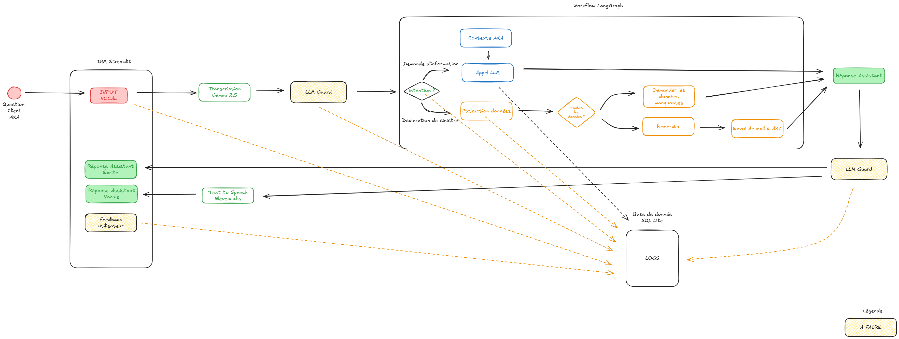

# AutoClaim, an AXA Assistant

  

## Launch the app

### Using Python locally

- python3 -m venv .venv

- source .venv/bin/activate

- pip install -r requirements.txt

- streamlit run src/app.py

### Deploy on Connect Posit Cloud (account : alban.kerloch@gmail.com)

- push a new commit to main

- this url is updated automatically : https://0199c879-4565-15ff-d356-d19689459be9.share.connect.posit.cloud/

## Architecture

### Architecture Actuelle

### Architecture Cible

| Description | Vue  |
|---:|---|
| Agent N8N |  |
| Seveur MCP N8N |  |

## Licence

- MIT License (Open source) — voir le fichier [LICENSE](LICENSE)

